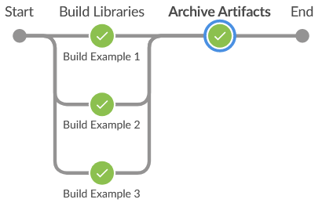
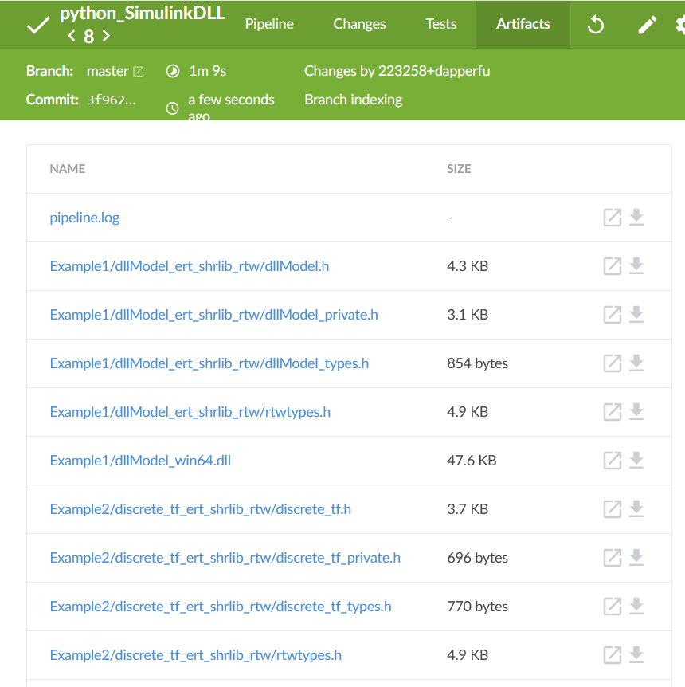

# Python-Simulink

Run your Simulink models & libraries in Python.

## Motivation

1. Running model in the loop tests with Simulink becomes time consuming with Matlab & Simulink overhead. There are ways to reduce it (Model reference, etc) however nothing has shown to be as fast as a precompiled shared library.

2. Python has a very mature set of tools and packages to automate testing.

3. Testing can be distributed to machines without Matlab/Simulink licenses.

4. There are more and more Python developers. Being able to hand off a Simulink Library for further use there is a good feature.

## Use cases

1. Use Python and it's ecosystem to run complex Simulink models.
2. Use Python & `pytest` to run Model-in-the-Loop (MIL) tests on Simulink subsystems.
3. Give Simulink algorithms to developers without Matlab/Simulink licenses to use.
4. Use GitHub/GitLab actions and Python to automate testing in the cloud.
5. Start a programming language war at your company.

##  Disclaimer

This repository is a set of instructions, with examples, on how to create a Pythonic wrapper for Simulink models. It **is not** a turnkey Python module to do this:

```python
import simulinkdll
simulinkdll.run("my_model.slx")
do_stuff()
```

For a given library or model configuring the Python should only need done when the Simulink Parameters/Signals change. The end developer will then be able do a `import simulink_model`, but it takes development time.

### High level instructions.

1. [Create a shared library in Simulink.](https://www.mathworks.com/help/ecoder/ug/creating-and-using-host-based-shared-libraries.html)
2. Create Python representations of all items in the header file.
3. Open the shared library (`.dll`, `.so`) in Python and run the model.

# Examples

### [Simple DLL Export](https://nbviewer.jupyter.org/github/dapperfu/python_SimulinkDLL/blob/master/Example1/dllModel.ipynb)

- For demonstrating minimal dll functionality and the steps required to run a model in Python.
- Demonstrate implementions of `SimulinkGlobal` vs  `ExportedGlobal` in `Simulink.Parameter` and `Simulink.Signal` variables.


### [Discrete Transfer Function](https://nbviewer.jupyter.org/github/dapperfu/python_SimulinkDLL/blob/master/Example2/discrete_tf-python_class.ipynb)


A simple discrete transfer function. Compiled with a 1st order low pass filter.

There are two example notebooks for Example 2.

1. [Simple Example](https://nbviewer.jupyter.org/github/dapperfu/python_SimulinkDLL/blob/master/Example2/discrete_tf.ipynb) - A simple low-level ctypes wrapper.
2. [Pythonic Example](https://nbviewer.jupyter.org/github/dapperfu/python_SimulinkDLL/blob/master/Example2/discrete_tf-python_class.ipynb) - Use Python syntactic sugar to create a high level [TransferTF python](https://github.com/dapperfu/python_SimulinkDLL/blob/master/Example2/discretetf.py) class to interact with the model. Adds datalogging and pandas integration.

- Example 2 also contains sample `pytest` tests in the [`tests`](https://github.com/dapperfu/python_SimulinkDLL/tree/master/Example2/tests) directory. This demonstrates how you can use `pytest` to test Simulink models. Sample test results are shown shown in [Example2/test_results.md.](https://github.com/dapperfu/python_SimulinkDLL/blob/master/Example2/test_results.md)

- Tests can be run on [GitHub actions](https://github.com/features/actions) as well. An example of pipeline file is provided: [.github/workflows/blank.yml](https://github.com/dapperfu/python_SimulinkDLL/blob/master/.github/workflows/blank.yml).

  This is an example badge: [](https://github.com/dapperfu/python_SimulinkDLL/actions/workflows/blank.yml)


### [Bouncing Ball](https://nbviewer.jupyter.org/github/dapperfu/python_SimulinkDLL/blob/master/Example3/bouncing_ball.ipynb)

Adapted from [Mathworks's Simulation of a Bouncing Ball](https://www.mathworks.com/help/simulink/slref/simulation-of-a-bouncing-ball.html)


Running a Simulation in Simulink also has some overhead. By compiling the model to a shared library and executing it, this overhead is eliminated.

`bouncing_ball_benchmark.m` benchmarks the model by testing increasingly smaller time steps. The model was then compiled and tested in Python and the corresponding times are recorded below.

| Time Step | Simulink Duration (s) | Python Duration (s) |
| --------- | --------------------- | ------------------- |
| 1e-4      | 0.5905                | 0.06                |
| 1e-5      | 1.0461                | 0.61                |
| 1e-6      | 8.1991                | 6.08                |
| 1e-7      | 78.9901               | 60.18               |

# Jenkins Build Automation

This project also serves as a proof of concept for using [CI/CD devops techniques](https://www.atlassian.com/continuous-delivery/principles/continuous-integration-vs-delivery-vs-deployment) with Simulink Models. There is a [`Jenkinsfile` ](Jenkinsfile) that will build each of the examples and archive the artifacts:

- shared library (`.dll`)
- header files (`.h`)

Jenkins Pipeline screenshot:



Jenkins Artifacts screenshot:



# Discussion, Questions & Feedback

- https://github.com/dapperfu/Python-Simulink/discussions

Google Indexing:

- MIL Python, Model-In-The-Loop Python.
- SIL Python, Software-In-The-Loop Python.
- Model-in-the-loop testing with Python.
- Software-in-the-loop testing with Python.
- Using Python for SIL testing. Using Python for MIL testing.
